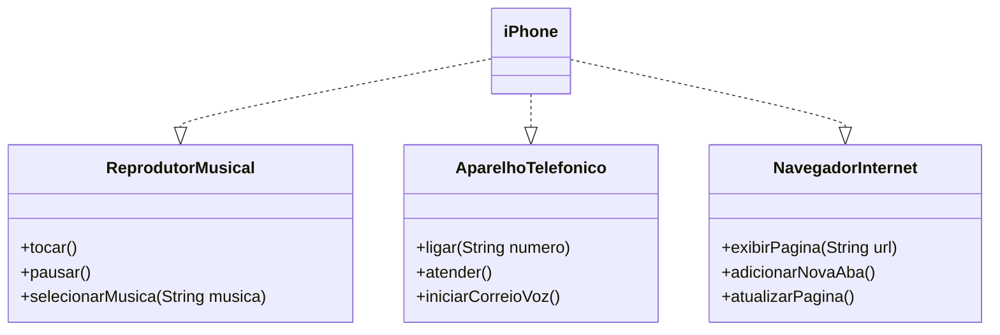

# 📱 Desafio POO - iPhone com Java


> Desafio proposto na plataforma [DIO](https://www.dio.me) para aplicar conceitos de **POO em Java**, modelando um iPhone com base na apresentação original de 2007 feita por Steve Jobs.

---

## 🎯 Objetivo

Modelar e implementar uma aplicação Java orientada a objetos que simule o comportamento de um **iPhone**, considerando três funcionalidades principais:

- 🎵 **Reprodutor Musical**
- ☎️ **Aparelho Telefônico**
- 🌐 **Navegador na Internet**

---

## 📐 Diagrama UML (Mermaid)



🧩 Estrutura de Arquivos

``` css
        📁 src/
    ├── AparelhoTelefonico.java
    ├── NavegadorInternet.java
    ├── ReprodutorMusical.java
    ├── iPhone.java
    └── Main.java
```
▶️ Como Executar

1. Clone o repositório:

```
git clone https://github.com/alexandrealvees/sandaner-code-2025.git
cd sandaner-code-2025
```
2. Compile os arquivos:

```bash
javac *.java
```

3. Execute o programa:

```bash
java Main
```

🧪 Exemplo de Saída

```less
🎵 Tocando música...
🎶 Música selecionada: Imagine - John Lennon
⏸️ Música pausada.
📞 Ligando para: 11999999999
✅ Chamada atendida.
📬 Iniciando correio de voz...
🌐 Exibindo página: https://www.apple.com
🆕 Nova aba adicionada.
🔄 Página atualizada.
```

👨‍💻 Autor

Desenvolvido por Alexandre Alves para o desafio da DIO
